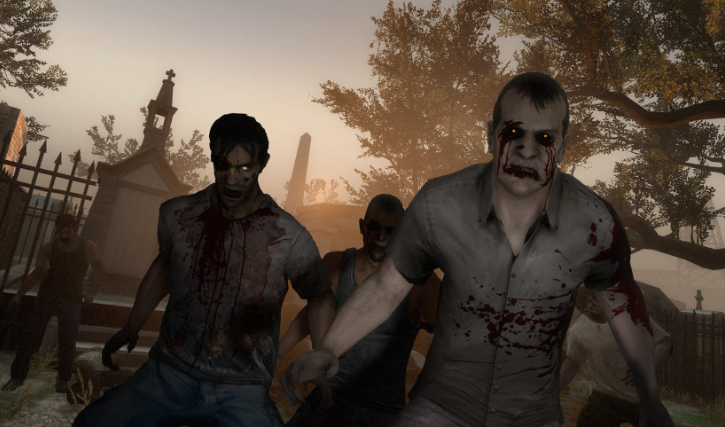

# 프로젝트명: Every Day (윤종수)

# 목차
1. [프로젝트 소개](#프로젝트-소개)
2. [컨셉](#컨셉)
3. [이미지](#이미지)
4. [구성요소](#구성요소)
5. [개발 요구사항](#구성요소-분석)
6. [개발 요구사항과 흐름도](#개발-요구사항과-흐름도)

## 프로젝트 소개
### 게임 소개

#### 게임 설명
아포칼립스 세계에서 좀비를 죽이거나 피하며 임무를 클리어 하는 게임

#### 목표
게임 클리어와 생존을 위해 아이템을 사용하여 HP를 관리하며, 주 임무를 완수하면 클리어

#### 프로젝트 주요 기능
캐릭터 이동 및 공격  
좀비 AI 및 리스폰  
아이템 및 인벤토리  
게임 UI 및 상호작용  
사운드  

## 컨셉

### 메인 컨셉
좀비를 메인으로 한 FPS  

### 서브 컨셉: 수집
아이템을 맵 곳곳에서 찾아 획득

### 서브 컨셉: 아이템
아이템이 있어 HP를 관리

### 서브 컨셉: HP
HP 시스템이 있어 아이템으로 HP를 관리

### 서브 컨셉: 좀비
좀비들은 3가지의 종류가 있으며 종류에 따른 HP와 데미지를 가지고 있음

## 이미지
### 관련 이미지

## 구성요소
### 매커니즘
[도전과제]  
1. 미션을 클리어

[재미요소]
1. 미션을 통해 목표를 가지고 게임을 플레이
2. 좀비들을 피하거나 공격하여 스릴과 쾌감

### 이야기
[만들게된 배경]  
편입 후 첫 게임을 아무것도 모르는 채 게임을 제작하여 아쉬움이 남아 지금까지 학교에서 배운 지식을 배경으로 그때 완성시키지 못했던 게임을 완성시켜보고 싶다는 생각이 있었음   

### 미적요소
[디자인]  
어두운 분위기를 강조하기 위해 밤 배경
어둡다 보니 라이트에 의지해야 함
  
[음향]
물가에 가면 물소리가 들리고 나뭇잎이 떨어지며 바람 소리 등의 배경 사운드
캐릭터가 움직일 시 상황에 맞는 사운드
좀비에게 발각 시 사운드

### 기술
유니티를 이용하여 PC용으로 개발

## 구성요소 분석
### 게임 오브젝트 분해

  
접기 / 펼치기

  
|연변|종류|오브젝트 이름|이미지|  
|:-:|:-----:|:-----:|:-----------------:|
|1|좀비|남자 일반 좀비||
|2|좀비|여자 일반 좀비|||
|3|좀비|뛰는 좀비|||
|4|좀비|탱크 좀비|||
|5|아이템|콜라|||
|6|아이템|매디킷|||
|7|아이템|토마토 스프|||
|8|아이템|미네스트로네|||
|9|아이템|완두콩 스튜|||
|10|퀘스트 아이템|백신|||
|11|퀘스트 아이템|나무 판자|||

  
### 파라미터(속성)
오브젝트 이름 : 좀비
|속성|설명|
|:-----:|:------------------------------------|
|공격|플레이어와의 거리가 일정거리 이상이 될 경우 공격을 실행|
|쿨타임|공격에 쿨타임을 적용하여 많은 타격을 방지|
|행동|좀비는 플레이어와의 거리에 따른 행동|
|체력|좀비의 체력|
|스피드|좀비의 스피드|

오브젝트 이름 : 플레이어
|속성|설명|
|:-----:|:----------------------|
|체력|체력은 100으로 고정이며 100 이상 회복할 경우 100으로 초기화|
|행동|조준, 발사, 걷기, 달리기, 앉기, 점프|
|스피드|걸을 때의 속도와 달릴 때의 속도|

### 게임 규칙
1. 좀비를 공격 혹은 피하기
2. HP가 0이 될 시 게임 종료
3. 모든 미션 클리어 시 게임 종료
4. 아이템을 사용하여 HP 회복

### 게임에 사용될 공식
#### 공격 공식
1. 플레이어가 좀비를 향해 총을 발사할 시 좀비의 HP가 감소
2. 좀비가 플레이어에게 일정 거리 이상 다가올 시 플레이어의 HP가 감소

#### 미션 공식
주어진 미션을 클리어시 다음 미션을 할 수 있게 만듬

## 개발 요구사항과 흐름도
### 요구사항
#### 1. 시작화면
1-1. 처음 시작시 화면에서 게임시작 버튼과 설정, 게임종료 버튼이 있다.
1-2. 게임시작 버튼을 클릭 시 게임 화면으로 넘어가게 된다
1-3. 설정 버튼을 클릭 시 설정창이 나오며 해상도, 사운드 조절이 가능하다
1-4. 게임종료 버튼을 클릭 시 게임을 종료하게 된다
