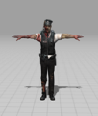
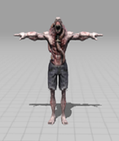
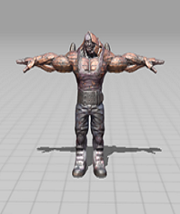

# 프로젝트명: Every Day (윤종수)

# 목차
1. [프로젝트 소개](#프로젝트-소개)
2. [게임 소개](#게임-소개)
3. [기능 및 컨텐츠](#기능-및-컨텐츠)
4. [대표 이미지](#대표-이미지)
5. [요구사항 및 분석](#요구사항-및-분석)
6. [구현영상](#구현영상)

## 프로젝트 소개
게임명 : Every Day (ED)
개발자 : 윤종수
개발연도 : 2024
장르 : FPS
개발도구 : Unity 3D
플랫폼 : PC

## 게임 소개

### 게임 설명
아포칼립스 세계에서 좀비를 죽이거나 피하여 미션을 클리어하는 게임

### 목표
생존과 게임 클리어를 위해 음식, 물, 구급상자 등의 아이템을 사용하여 HP를 관히라며, 주 임무를 완수하면 클리어

### 이야기
[만들게된 배경]  
편입 후 첫 게임을 아무것도 모르는 채 게임을 제작하여 아쉬움이 남아 지금까지 학교에서 배운 지식을 배경으로 그때 완성시키지 못했던 게임을 완성시켜보고 싶다는 생각이 있었음   

## 기능 및 컨텐츠
### 기능
캐릭터 이동 및 공격 기능  
- WASD를 사용하여 캐릭터를 이동
- 마우스 좌클릭시 발사  
- 마우스 우클릭시 조준

좀비 AI  
- 좀비들은 랜덤한 일정시간마다 랜덤한 위치로 이동하며 순찰
- 플레이어와의 일정거리일 경우 추적
- 플레이어와 매우 가까워질경우 공격
- 애니메이션을 활용한 움직임 및 공격, 죽음 모션
- 플레이어에게 공격 받았을시 피 이펙트 효과

리스폰 시스템  
- 좀비들은 일정시간마다 플레이어 주변의 랜덤한 위치에서 리스폰

아이템 시스템  
- 아이템 획득 가능
- 플레이어의 HP가 100일 경우 사용 불가
- 플레이어의 HP가 90이며 아이템 회복량은 20이라면 최대 HP값인 100으로 회복

인벤토리 시스템  
- 아이템을 획득시 인벤토리에 저장
- I키를 누를시 인벤토리 창 활성화
- 드래그앤드롭 기능
- 아이템을 클릭시 아이템 사용

게임 UI 및 상호작용  
- 시작화면
- 일시정지
- 게임오버
- 미션 UI
- 안전지대 UI

사운드 및 배경 음악  
- 배경 소리
- 좀비 소리
- 총 소리
- 캐릭터 이동 소리

### 컨텐츠
게임 맵 디자인  
-  

좀비 3D 모델링  
-  
-  
-  
-  

아이템 모델링  
-  
-  
-  
-  
-  

## 대표 이미지

## 요구사항 및 분석
### 요구사항
#### 1. 시작 화면
1. 처음 시작 시 화면에서 게임 시작 버튼과 설정, 게임 종료 버튼이 있다.
2. 게임 시작 버튼을 클릭 시 게임 화면으로 넘어가게 된다.
3. 설정 버튼을 클릭 시 설정 창이 나오며 해상도, 사운드 조절이 가능하다.
4. 게임 종료 버튼을 클릭 시 게임을 종료하게 된다.
#### 2. 게임 화면
1. 시작 화면에서 게임 화면으로 넘어가게 되면 바로 플레이를 시작한다.
2. 왼쪽 상단에 해야 하는 미션에 대해서 설명해 준다.
3. 왼쪽 상단에는 플레이어의 체력과 기력이 표시된다.
4. 플레이어가 esc를 누르면 일시정지 창이 나오며 게임이 정지된다.
#### 3. 일시정지
1. 계속하기 버튼을 누르면 일시정지 창이 사라지고 게임이 재개된다.
2. 설정을 누르면 설정 창이 나오며 해상도, 사운드 조절이 가능하다.
3. 재시작 버튼을 누르면 게임은 씬을 다시 불러와 처음부터 시작한다.
4. 게임 종료 버튼을 누르면 게임을 종료한다.
#### 4. 게임 오버
1. HP가 0이 되어 게임 오버 창이 나올 시 좀비를 몇 마리 죽였는지에 대한 점수가 나온다.
2. 처음부터 버튼을 누르면 씬을 불러와 처음부터 시작한다.
3. 게임 종료 버튼을 누르면 게임을 종료한다.
#### 5. 좀비
1. 좀비는 플레이어와의 거리에 따라 행동을한다.
2. 일반 좀비는 플레이어와 거리가 멀면 랜덤한 방향으로 움직였다 멈췄다를 반복하며, 순찰을 한다.
3. 플레이어와의 거리가 일정이상이 되면 좀비들은 플레이어의 위치를 향해 움직인다.
4. 좀비들은 플레이어를 향해 움직이다가 플레이어와 가까워지면 공격 모션을 취하며, 플레이어를 공격한다.
5. 좀비들은 HP가 0이되면 일정시간 이후 오브젝트가 삭제된다.
6. 좀비들은 리스폰이후 일정 시간이 지나면 삭제된다.
7. 좀비들은 플레이어와의 거리가 멀어지면 플레이어를 따라가지 않는다.
#### 6. 플레이어
1. 플레이어는 좀비를 향해 총을 쏘면 좀비의 HP가 감소한다.
2. 플레이어의 HP가 0이될시 게임 오버 창이 뜬다.
3. 플레이어는 wasd를 사용하여 이동이 가능하며, Left Shift를 누르고 있어야 뛴다.
#### 7. 미션
1. 플레이어는 박사의 집으로 가라는 UI 텍스트 생성
2. 플레이어가 박사의 집 입구 도착시 안전지대 UI 텍스트 생성 및 좀비 스폰 일시정지
3. 플레이어는 박사의 집안에 도착시 백신을 찾아 확보
4. 플레이어는 백신을 확보했으면 바리케이트 구축을 위해 나무판자를 획득
5. 플레이어가 모든 나무판자를 획득시 특정 문과 창문에게 다가가 바리케이트 생성
6. 바리케이트가 생성되었을시 일정시간 이후 좀비들 공격
7. 좀비들이 공격을 시작하고 일정시간이 지나면 헬기 생성 및 탈출

## 구현영상

